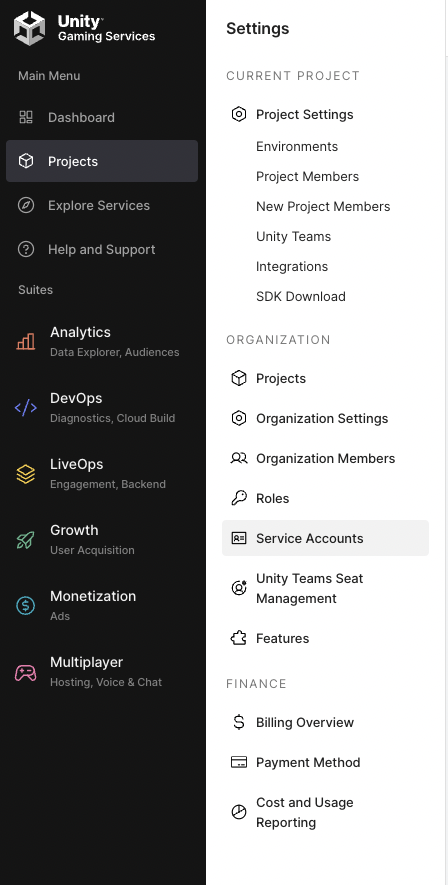

<div align="center">
<p align="center">


**The open-source tool for using Unity SOLO Datasets**
---

[](https://github.com/Unity-Technologies/pysolo/actions)
[](https://pypi.org/project/unity-vision)
[](LICENSE)

</p>
</div>

## Introduction

pysolo would allow you to the following:

- Parse SOLO datasets generated with Unity Perception.
- Dataset iterables.
- Dataset statistics.
- Clients to access remote datasets
  - Unity Computer Vision Datasets (UCVD)

## Pre-Requisites
- Install [Anaconda](https://docs.anaconda.com/anaconda/install/) or [Miniconda](https://docs.conda.io/en/latest/miniconda.html) (recommended). Install [pre-commit](https://pre-commit.com/).
- Make sure `pip` is installed.

## Installation

---
To install, run
```shell
pip install pysolo --index-url=https://artifactory.prd.it.unity3d.com/artifactory/api/pypi/pypi/simple
```

** The package lives in the internal PyPi repo for now.


#### SOLO Dataset

##### Local Datasets

```python
from pysolotools.consumers import Solo
solo = Solo(data_path="<<dataset-path>>")
```

Access frames with `FrameIterator`:

```python
solo.frames()
```


##### Cloud Datasets

###### Getting API Token

- Create a Unity account if you don't at [Unity Services](https://dashboard.unity3d.com/)
- Navigate to Projects and create a project if you don't have one.
- Navigate to Projects>Service Account in the dashboard to create a new one.

- Generate your API key.
- Save your API key somewhere safe, it will be used later.
- Navigate to Projects>Select the project to use and record the `Project ID`.
- Navigate to Projects>Orgaization Settings and record the `Organization ID`.


###### Downloading datasets from UCVD

```python
from pysolotools.clients import UCVDClient
client = UCVDClient(
    org_id="unity-org-id",
    project_id="unity-project-id",
    sa_key="sa-key",
    api_secret="api-secret"
)

client.download_dataset_archives("<<dataset-id>>")

```

## Sphinx Docs

[Github Pages](https://effective-train-86190335.pages.github.io/)

To generate docs locally:

1. `cd docs/`
2. `make html`

If you want to rebuild the rst files, please run: `make apidoc`. This will generate the rst files based off docstring comments. (Note: This does not update existing rst files).


## Additional Resources

### Blog Posts and Talks

- Data-centric AI with Unity Computer Vision Datasets [blogpost](https://blog.unity.com/technology/data-centric-ai-with-unity-computer-vision-datasets)
- Workshop notebook [Notebook](https://colab.research.google.com/drive/1yoR-47aGi9L0_3f0ULq9Udk0cC64V-0-?usp=sharing)


## Community and Feedback

The Unity Computer Vision demos are open-source and we encourage and welcome contributions.
If you wish to contribute, be sure to review our [contribution guidelines](CONTRIBUTING.md)
and [code of conduct](CODE_OF_CONDUCT.md).

## Support

For feature requests, bugs, or other issues, please file a
[GitHub issue](https://github.com/Unity-Technologies/Unity-Vision-Hub/issues)
using the provided templates we will investigate as soon as possible.

## Newsletter

## License
[Apache License 2.0](LICENSE)
